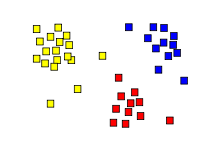
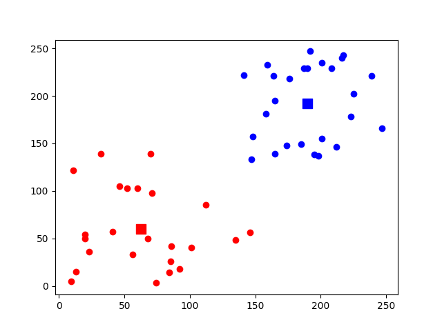
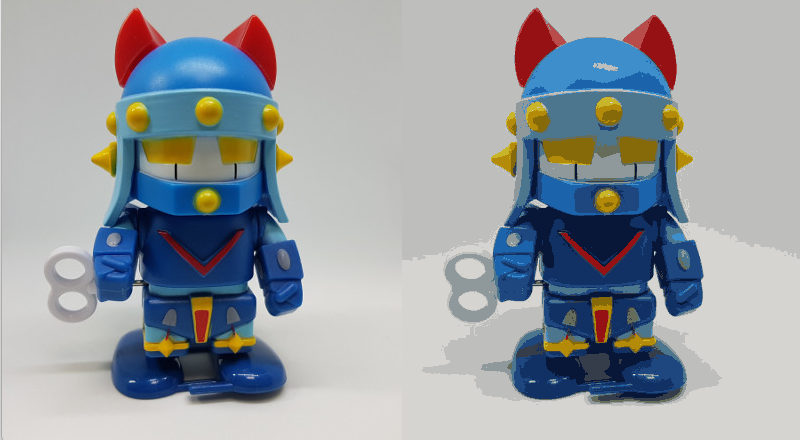
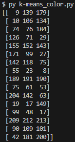

# 07_opencv

---

### 머신러닝 - K-평균 클러스터링

- 클러스터: **비슷한 특성을 가진 데이터끼리의 묶음.**
    - 비슷한 특성 → 가까운 위치
- 클러스터링: **어떤 데이터들이 주어졌을때, 그 데이터들을 클러스터로 그루핑 시켜주는 것.**
- 
    
    
    
    클러스터끼리 그루핑 됨
    
    ---
    

[k-means_random.py](./src/k-means_random.py)

- ret,label,center=cv2.kmeans(data,2,None,criteria,10,cv2.KMEANS_RANDOM_CENTERS)
- data: 처리 대상 데이터
- 2: 원하는 묶음 갯수
- None: 초기 레이블 정보(일반적으로 None사용)
- criteria: 종료 조건
- 10: 다양한 초기 중심값으로 반복 시도 횟수
- cv2.KMEANS_RANDOM_CENTERS: 초기 중심 값 선택 방법
    
    
    
    k-means_random.py 결과
    

---

[k-means_color.py](./src/k-means_color.py)

k-means_color.py 결과

---

[mnist.py](./src/mnist.py)