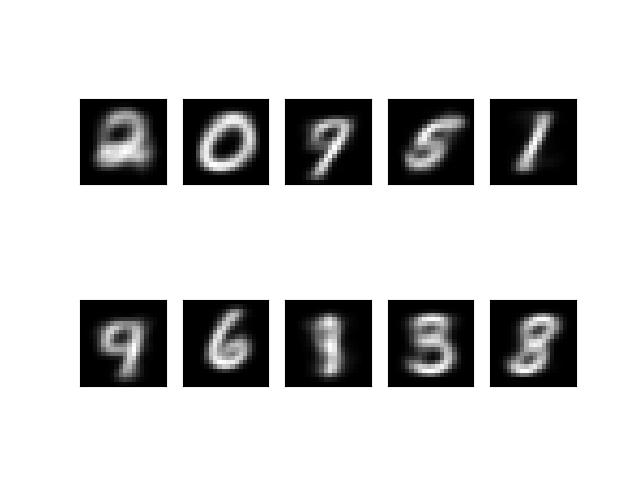
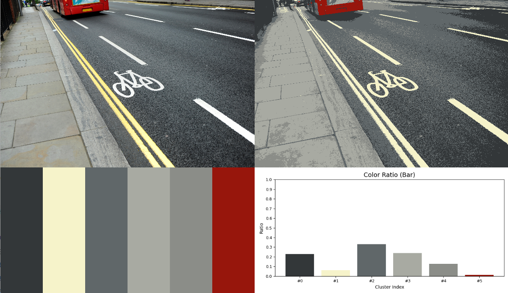
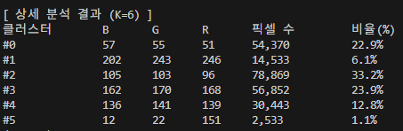
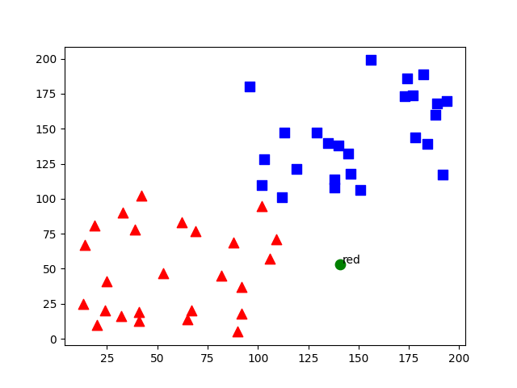
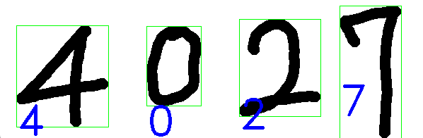
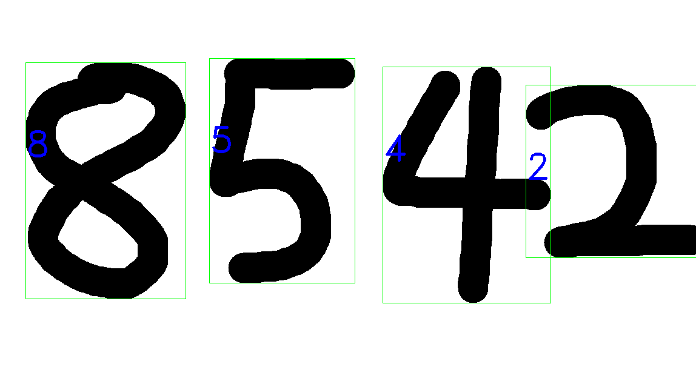

# 07_opencv

---

### 머신러닝 - K-평균 클러스터링

- 클러스터: **비슷한 특성을 가진 데이터끼리의 묶음.**
    - 비슷한 특성 → 가까운 위치
- 클러스터링: **어떤 데이터들이 주어졌을때, 그 데이터들을 클러스터로 그루핑 시켜주는 것.**
  
    
    
    
    클러스터끼리 그루핑 됨
    
    ---
    

코드: [k-means_random.py](./src/k-means_random.py)

- ret,label,center=cv2.kmeans(data,2,None,criteria,10,cv2.KMEANS_RANDOM_CENTERS)
- data: 처리 대상 데이터
- 2: 원하는 묶음 갯수
- None: 초기 레이블 정보(일반적으로 None사용)
- criteria: 종료 조건
- 10: 다양한 초기 중심값으로 반복 시도 횟수
- cv2.KMEANS_RANDOM_CENTERS: 초기 중심 값 선택 방법
    
    
    
    k-means_random.py 결과
    

---

코드: [k-means_color.py](./src/k-means_color.py)

### 결과

k-means_color.py 결과

k-means_color.py 터미널 창 결과

---

코드: [mnist.py](./src/mnist.py) - mnist 모듈

코드: [k-means_handwritten.py](./src/k-means_handwritten.py)

- 미리 만들어둔 모듈(mnist.py)을 사용함.

### 결과
  
 
---
## 오전 실습

- 실습 차선 색상 분류
    - 시각적 결과: 원본 이미지
    - 색상 팔레트: 추출된 3가지 대표 색상
    - 분포 차트: 각 색상이 차지하는 비율
    - 상세 분석: BGR 값과 픽셀 수/비율 정보

코드: [250805_kmeans_color.py](./src/250805_kmeans_color.py)

### 결과

250805_kmeans_color.py 결과

터미널 창 결과(상세 분석)

---
## 머신러닝 - K-최근접 이웃(KNN)

- 지도 학습 알고리즘 중 하나

[코드: kNN_random.py](./src/kNN_random.py)

### 결과

kNN_random.py 결과

---

[kNN_mnist.py - 모듈](./src/kNN_mnist.py)

[kNN_handwritten.py](./src/kNN_handwritten.py)

### 결과

4027 인식 결과

직접 쓴 숫자 8542 인식 결과

---

## 오후 응용 실습
- 옷 색상 K-NN 분류
 - 목표: 웹캠으로 촬영한 옷의 색상을 K-NN 알고리즘으로 자동 분류하는 시스템 구현

## 2단계: 옷 색상 데이터셋 구축
 - 기본 색상 7가지 선정
    - 빨간색(Red)
    - 파란색(Blue)
    - 초록색(Green)
    - 노란색(Yellow)
    - 검은색(Black)
    - 흰색(White)
    - 회색(Gray)
 - 색상 샘플 수집 시스템 구현
    - 마우스 클릭 이벤트 핸들러 작성
    - 클릭한 픽셀의 RGB/HSV값 추출
    - 숫자키(1-7)로 색상 라벨 지정기능
    - 수집된 데이터 실시간 화면 표시
 - 학습데이터 수집 과정
    - 각 색상당 최소 30개 샘플 수집
    - 다양한 조명 조건에서 촬영
    - 옷감 질감(면, 니트, 데님 등) 다양화
    - CSV 파일로 데이터 저장(color_dataset.csv)
---
 - 구현코드: [collect_colors.py](./src/250805_kNN_color/collect_colors.py)
 - 작동 방식: 화면 중앙 네모 칸 안에 인식할 색상을 넣고 1~7 번을 눌러 각 색상에 맞는 라벨링을 한다. 이후 's'를 누르면 csv 파일로 저장한다.
---
 ## 3단계: K-NN 모델 구현
 - 데이터 전처리
    - CSV 파일에서 학습 데이터 로드
    - RGB 값 정규화(0-255 -> 0-1)
    - 특성(x)과 라벨(y) 분리
    - 학습/테스트 데이터 분할(8:2 비율)
 - K-NN 모델 학습
    - 직접 K-NN 알고리즘 구현
    - 최적 K값 탐색(K=3, 5, 7, 9 테스트)
    - 유클리드 거리 기반 최근접 이웃 탐색
    - 최적 모델 선택 및 저장
 - 모델 성능 평가
    - 테스트 데이터로 정확도 측정
    - 각 색상별 분류 성능 분석
    - 잘못 분류된 케이스 시각화
 ---
  - 구현 코드: [kNN_model.py](./src/250805_kNN_color/kNN_model.py)
  - 작동 방식: kNN_model.py를 실행하면 데이터파일(color_dataset.csv)를 읽어와 kNN.model.pkl 파일을 생성한다.
---
 ## 4단계; 실시간 옷 색상 인식 구현
 - ROI(관심 영역) 설정
    - 화면 중앙에 사각형 ROI 표시
    - ROI 크기 조절 가능(기본 100X100)
    - ROI 위치 마우스로 이동 가능
    - ROI 영역 시각적 하이라이트
 - 실시간 색상 추출 및 예측
    - ROI 영역의 평균 RGB 값 계산
    - 학습된 K-NN 모델로 색상 예측
    - 예측 결과와 확률 계산
    - 프레임별 연속 예측 수행
 - 결과 시각화
    - 예측된 색상명 화면에 표시
    - 예측 확률 백분율로 표시
    - 색상별 신뢰도 바 그래프
    - 예측 히스토리 기록(최근 10개)
---
 - 구현 코드: [predict_colors.py](./src/250805_kNN_color/predict_colors.py)
 - 작동 방식: 화면 중앙의 네모 영역에 색상을 가져다 대면 왼쪽 상단에 색상:일치율(%)가 표시된다.
 ---
 ## 5단계: 사용자 인터페이스 구현
 - 키보드 조작 기능
    - 'L'키: 학습 모드 전환
    - 'P'키: 예측 모드 전환
    - 'S'키: 모델 저장
    - 'R'키: 데이터셋 리셋
    - 'Q'키: 프로그램 종료
 - 화면 정보 표시
    - 현재 모드 상태 표시(학습/예측)
    - 수집된 데이터 개수 표시
    - 모델 정확도 실시간 업데이트
    - 조작 가이드 텍스트 표시
 - 데이터 관리기능
    - 학습 데이터 자동 저장
    - 기존 모델 불러오기
    - 잘못된 데이터 삭제 기능
    - 데이터셋 백업 및 복원

 ## 6단계: 성능 최적화 및 개선
 - 색상 인식 정확도 향상
    - HSV 색공간 추가 활용
    - 조명 보정 알고리즘 적용
    - 노이즈 제거 필터링
    - 다중 프레임 평균화

 - 실시간 처리 속도 최적화
    - 프레임 처리 시간 측정
    - ROI 크기 최적화
    - 불필요한 연산 최적화
    - 목표: 30FPS 이상 달성

 ## 최종 체크리스트
 - 기본 기능 구현
    - 웹캠 실시간 영상처리
    - 7가지 옷 색상 분류 모델
    - K-NN 알고리즘 정확한 구현
    - 사용자 친화적 인터페이스

 - 성능 목표 달성
    - 85% 이상 분류 정확도
    - 30FPS 이상 실시간 처리
    - 안정적인 ROI 기반 인식
    - 다양한 조명 조건 대응
 - 확장 기능
    - 모델 저장/불러오기
    - 데이터셋 관리 기능
    - 성능 모니터링 시스템
